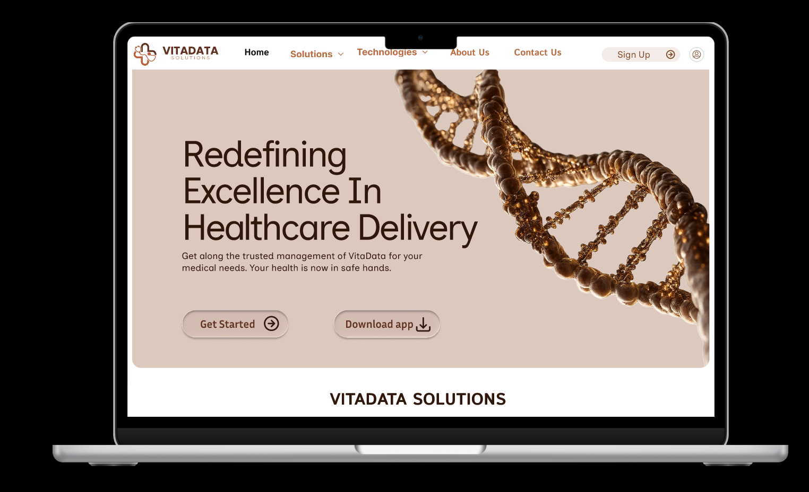

# VITADATA SOLUTIONS



VITADATA SOLUTIONS is a modern healthcare-focused web platform designed to present services, technology capabilities, and company information with a clean and trustworthy interface. The project focuses on responsive UI, reusable components, and scalable front-end architecture.

## Project Overview

This project is built as a production-ready front-end using the Next.js App Router architecture. The goal is to deliver a high-quality user experience for visitors while keeping the codebase maintainable for future feature updates.

Core highlights:

- Responsive layout for desktop and mobile screens
- Reusable UI components powered by shadcn/ui
- Tailwind CSS based styling system
- Component-driven React architecture inside Next.js

## Tech Stack

- Next.js
- React
- Tailwind CSS
- shadcn/ui

## Design Reference

Figma: https://www.figma.com/design/l4ZBW6U6ETCROLCoUpJO5q/VITADATA-SOLUTIONS?node-id=0-1&t=oPvNHOPYSxcuVuQS-1

## Getting Started

Run the development server:

```bash
npm run dev
```

Then open http://localhost:3000 in your browser.

## Contribution Guidelines

We welcome contributions and improvements.

1. Fork the repository.
2. Create a new feature branch.
3. Make your changes with clear commit messages.
4. Ensure the application builds and runs locally.
5. Open a pull request with a short summary of what changed.

Recommended contribution areas:

- UI and responsiveness improvements
- Performance optimization
- Accessibility enhancements
- Component refactoring and reuse
